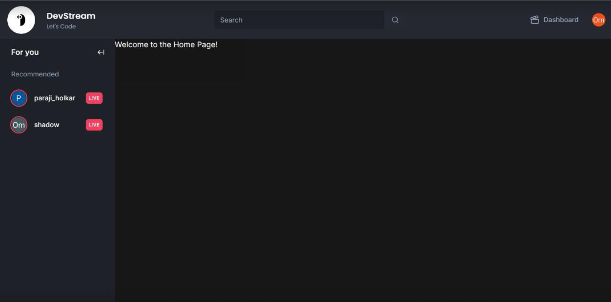
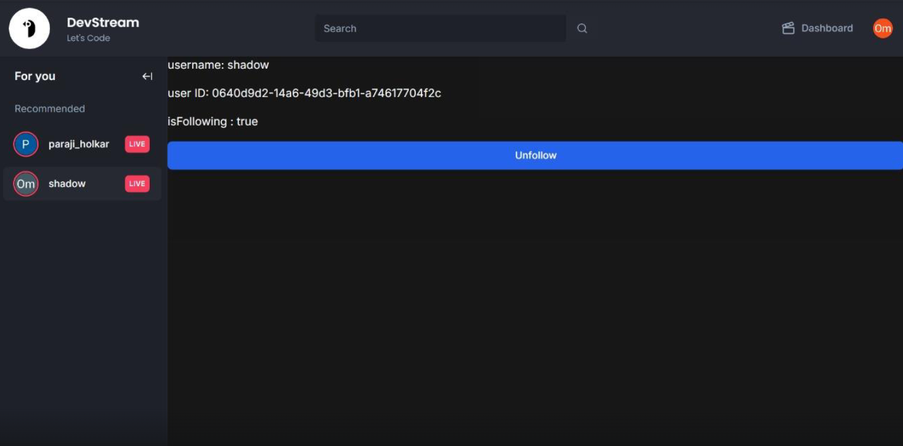

# Dev-Stream

**Note:** This project is currently under active development. Features and implementations are subject to change.

## Overview

Dev-Stream is a specialized video streaming platform designed for developers. It offers a dedicated space where developers can share technical knowledge through **live streams, tutorials, and real-time coding sessions**. The platform aims to foster **collaboration and engagement** within the developer community.

## Key Features

- 🚀 **Live Coding Streams** – Broadcast real-time coding sessions with minimal latency.
- 💬 **Real-Time Chat** – Integrated WebSocket-based chat for instant interaction between viewers and streamers.
- 💰 **Superchat Donations** – Viewers can support streamers by sending highlighted messages during live sessions.
- 📂 **Content Management** – Upload, tag, and organize videos while accessing engagement analytics.
- 🔒 **Secure Payment Integration** – Safe and reliable processing of superchat donations and subscriptions.

## Technology Stack

- **Frontend:** Next (Web) & Flutter (Mobile) for a seamless user experience.
- **Backend:** Ingress for request routing and load balancing.
- **Database:** MySQL for structured and scalable data management.
- **Cloud & Storage:** AWS S3 for video storage and CDN for optimized content delivery.

## Installation & Setup

Since the project is still under development, detailed setup instructions will be added soon. Stay tuned for deployment guides and contribution guidelines.

## Contributing

We welcome contributions! Check back later for contribution guidelines and issue tracking.

---

### 📢 Stay Updated

Follow the repository for the latest updates as we continue to build **Dev-Stream** into a robust platform for developers. 🚀

---

## Screenshots of the project so far

